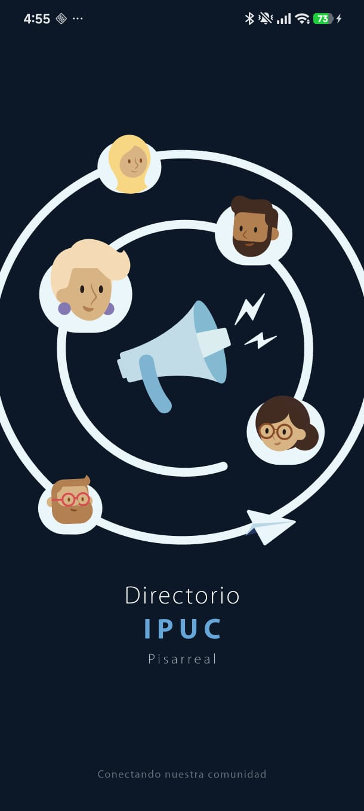
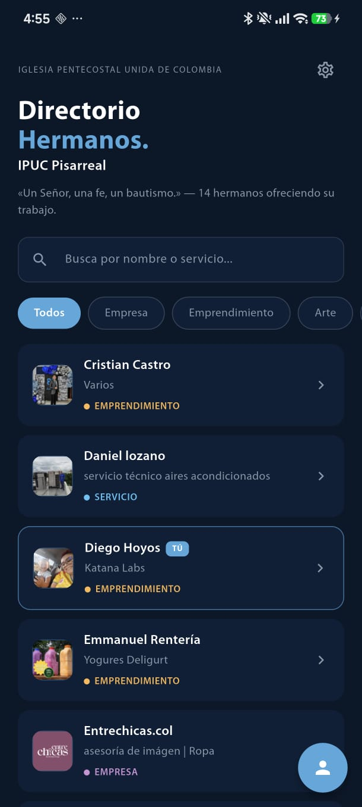
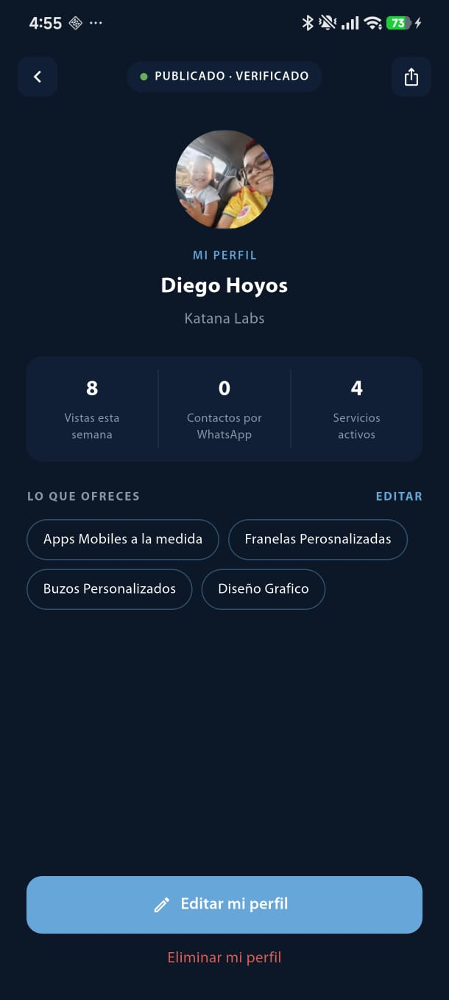
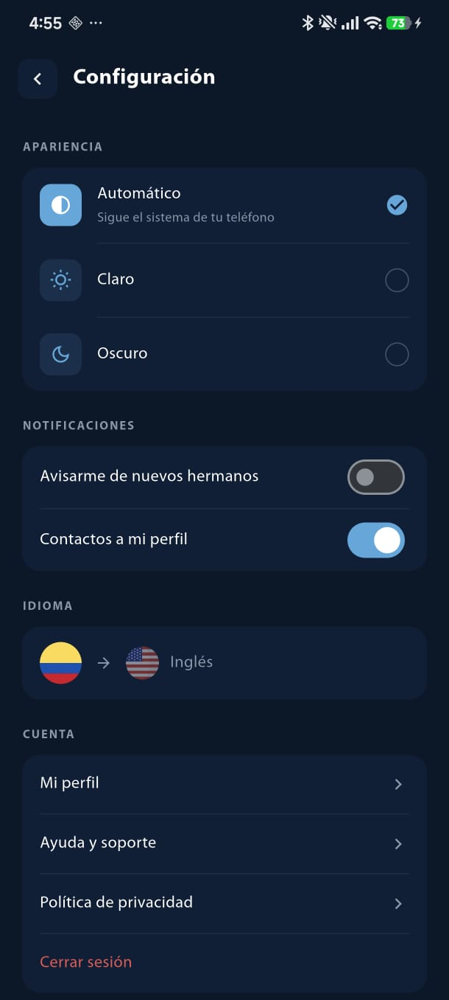

<div align="center">
  

  # Directorio IPUC Pisarreal

  **Conectando nuestra comunidad.**
  El directorio de hermanos de la Iglesia Pentecostal Unida de Colombia — Congregación Pisarreal.

  [](https://flutter.dev)
  [](https://firebase.google.com)
  [](#)
  [](#)

  [🌐 Sitio web](https://ipuc-pis-directory.web.app) · [✨ Landing page](https://diegohch.github.io/directory_ipuc_pis/) · [🔒 Privacidad](https://diegohch.github.io/directory_ipuc_pis/privacy-policy)
</div>

<br>

<div align="center">
  
  
  
  
</div>

## Sobre el proyecto

**Directorio IPUC Pisarreal** es una app para que los hermanos de la congregación se encuentren entre sí, descubran los servicios y emprendimientos que cada uno ofrece, y se contacten directamente por WhatsApp — todo en un solo lugar, disponible como app móvil y como app web instalable (PWA).

## Funciones

- 📇 **Directorio de hermanos** — búsqueda por nombre o servicio, filtrado por categoría (empresa, emprendimiento, arte, servicio).
- 👤 **Perfil personal** — cada hermano publica su foto, sus servicios y una breve descripción, con estadísticas de vistas y contactos recibidos.
- 💬 **Contacto directo por WhatsApp** — un toque desde el perfil, sin pasos intermedios.
- 🔔 **Notificaciones push** — avisa cuando llega un nuevo hermano al directorio o cuando alguien contacta tu perfil.
- 🔐 **Autenticación con recuperación de contraseña** — correo y contraseña vía Firebase Auth, con flujo de "olvidé mi contraseña".
- 🌗 **Tema claro / oscuro** — automático según el sistema, o manual desde ajustes.
- 🌎 **Español e inglés** — localización completa vía `flutter gen-l10n`.
- 🗑️ **Control total de tu cuenta** — edición y eliminación de perfil en cualquier momento.

## Stack técnico

| Área | Tecnología |
|---|---|
| Framework | Flutter (Dart, `sdk: ^3.11.3`) |
| Estado | Riverpod (`flutter_riverpod`) |
| Navegación | `go_router` |
| Backend | Firebase — Auth, Cloud Firestore, Cloud Messaging |
| Imágenes de perfil | Cloudinary |
| Notificaciones push (server) | Cloudflare Worker (`cloudflare/worker.js`) |
| Hosting | Firebase Hosting (web/PWA) |
| Distribución | Firebase App Distribution (Android/iOS), Google Play (en prueba cerrada) |
| Localización | `intl` + `flutter gen-l10n` (es/en) |

## Estructura del proyecto

```
lib/
├── core/               # infraestructura compartida
│   ├── extensions/     # extensiones de contexto (l10n, colores)
│   ├── providers/      # providers globales (tema, idioma, notificaciones)
│   ├── router/         # configuración de go_router
│   ├── services/       # servicios (notificaciones, etc.)
│   ├── theme/          # sistema de diseño (colores, tipografía, espaciado)
│   ├── utils/          # utilidades (errores localizados, etc.)
│   └── widgets/        # widgets reutilizables
├── features/           # un módulo por funcionalidad
│   ├── auth/           # login, recuperación de contraseña
│   ├── directory/      # listado y perfil de hermanos
│   ├── edit_profile/   # edición de perfil
│   ├── my_profile/     # perfil propio
│   ├── register/       # creación de cuenta
│   ├── settings/       # ajustes (tema, notificaciones, idioma, cuenta)
│   └── splash/         # pantalla de bienvenida
└── l10n/               # archivos .arb (es/en)

docs/                   # landing page pública (GitHub Pages)
cloudflare/             # Worker para notificaciones push
functions/              # Cloud Functions
```

## Empezando

### Requisitos

- [Flutter](https://docs.flutter.dev/get-started/install) (se recomienda usar [FVM](https://fvm.app) para fijar la versión del SDK)
- Un proyecto de Firebase con Auth, Firestore y Cloud Messaging habilitados
- `flutterfire configure` ya corrido (genera `firebase_options.dart`)

### Instalación

```bash
git clone https://github.com/DiegoHCH/directory_ipuc_pis.git
cd directory_ipuc_pis
fvm flutter pub get
```

### Correr en local

```bash
fvm flutter run
```

### Generar traducciones

Después de modificar `lib/l10n/app_es.arb` o `app_en.arb`:

```bash
fvm flutter gen-l10n
```

### Publicar la web (Firebase Hosting)

```bash
fvm flutter build web --release
firebase deploy --only hosting
```

### Publicar builds móviles (Firebase App Distribution)

```bash
make release-android   # build + distribute Android
make release-ios       # build + distribute iOS
```

## Privacidad

Este proyecto maneja datos personales de la congregación (nombre, WhatsApp, correo, fotos). La política de privacidad completa está publicada en [`docs/privacy-policy.md`](docs/privacy-policy.md).

---

<div align="center">
  <sub>Educación Cristiana - IPUC Pisarreal · Los Patios, Norte de Santander, Colombia</sub>
</div>
